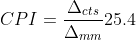

# PAA5100JE Driver
Driver for PixArt PAA5100JE driver. Tested on Teensy 4.0 board.
Currently, there are 2 breakout boards on the market that I am aware of, from:

    -Pimoroni (https://shop.pimoroni.com/products/paa5100je-optical-tracking-spi-breakout)
    -EPS global (https://www.epsglobal.com/products/semiconductors/sensing-and-haptics/optical-tracking/paa5100je-q-sensor-kit)

This driver is tested on EPS global breakout board.
PAA5100JE sensor has NRESET pin, which is active low. On Pimoroni board it is connected to
3.3V, and on EPS global it is unconnected. As it should not be left floating, on the EPS board, 
write (if you do not want to use NRESET):
```c++
    pinMode(NRESET_PIN, OUTPUT);
    digitalWrite(NRESET_PIN, HIGH);
```

To use the PAA5100JE driver, initialize it (it uses the default SPI bus, but another bus can be forwarded at initialization):
```c++
    PAA5100JE_OF sensor(CS_PIN);
    bool PAA5100JE_OF::init();
```

PAA5100JE has a working height from 15 mm to 35 mm (from the top of the lens to the working surface), and CPI depends on working height. To set height [and CPI] use:
```c++
    void PAA5100JE_OF::setWorkingHeight(float height);
```

If you can not measure PAA5100JE working height preceise enough, another approach can be used. Move senosor at known distance, use motionRead() method to get number of counts and calculate CPI value 
using this formula:
<p align="center"></p>


And then set CPI, using setCPI() method:
```c++
    void PAA5100JE_OF:: setCPI(double CPI);

```

PAA5100JE driver can change X and Y axis:
```c++
    void PAA5100JE_OF::setOrientation(bool invertX, bool invertY, bool swapXandY)
```

PAA5100JE sensor can read delta values (in pulses) in 2 different modes, normal and burst mode. 
Difference is, that burst mode does not have delay between reading values.
```c++
    bool PAA5100JE_OF::motionRead(int16_t deltaVal[]);
    bool PAA5100JE_OF::burstMotionRead(int16_t deltaVal[]);
```

To read values scaled in mm, use (before using this method, working height must be defined, 
as CPI depends on it):
```c++
    bool PAA5100JE_OF::getDistance(float deltaVal[]);
    bool PAA5100JE_OF::getDistance_burst(float deltaVal[]);
```

The sensor has a **frame synchronization** feature, where its frames can be synched with multiple same PAA5100JE sensors, or another sensor (e.g. IMU), to get reading from the same time frame. Check the examples folder for boilerplate implementation.
